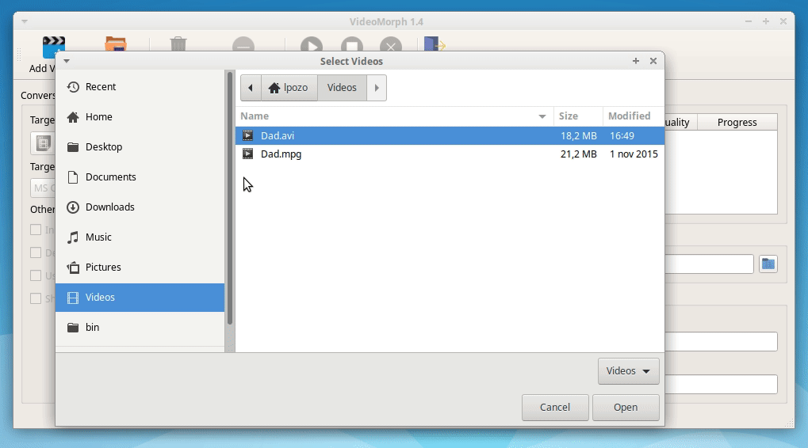

# VideoMorph

[](https://github.com/ellerbrock/open-source-badge/)
[](https://travis-ci.org/videomorph-dev/videomorph)
[](https://codecov.io/gh/videomorph-dev/videomorph)
[](https://codeclimate.com/github/videomorph-dev/videomorph/maintainability)
[](https://github.com/videomorph-dev/videomorph/pulls)

VideoMorph is a **video converter** based on [ffmpeg](http://ffmpeg.org), and written with [Python](https://python.org) 3, and [PyQt5](https://www.riverbankcomputing.com/static/Docs/PyQt5/introduction.html). With VideoMorph you can convert your favorite videos to the currently more popular video formats, like **MPG**, **MP4**, **AVI**, **WEBM**, **DVD**, **VCD**, **FLV**, **MOV**, **OGV**, and also extract the audio to a file with **MP3** format.

VideoMorph is a video converter, just that. If you're looking for a video editor, VideoMorph isn't for you.

VideoMorph is a GUI wrapper for [Ffmpeg](http://ffmpeg.org), based on general ideas from [python-video-converter](https://github.com/senko/python-video-converter), and presets idea from [QWinFF](http://qwinff.github.io).

## GUI Screenshot


## Requirements

VideoMorph uses the following libraries, and programs:

- [PyQt5](https://www.riverbankcomputing.com/static/Docs/PyQt5/introduction.html)

- [FFmpeg](http://ffmpeg.org)

- [Python](https://python.org) > 3.4

You need to install these programs, and libraries for VideoMorph to work properly.

On Windows systems, you also need:

 - [setuptools](https://pypi.python.org/pypi/setuptools)

## Installation

You can install, and use VideoMorph on Linux, and on Windows systems. There are several ways you can use to install the application. Let's take a look at them.

### Installing From the Binary Packages

If you're using Linux or Windows, then you can install VideoMorph by using the binary package for your current system.

#### On Linux

You can install VideoMorph on Ubuntu by running the following steps:

1. Download the `.deb` package

2. Open a terminal, and run the following commands:

```console
$ sudo apt install ffmpeg python3 python3-pyqt5
$ sudo dpkg -i videomorph_x.x_all.deb
```

That would be enough to get VideoMorph (and its dependencies) installed on your system.

You can also install VideoMorph's `.deb` package, by using GDebi, which is a GUI Packages Installer that will manage the dependencies for you.

#### On Windows

To install VideoMorph on your Windows system, you can:

1. Download the installer that corresponds to your architecture

2. Run the installer as `administrator`

3. Follow on-screen instructions

### Installing Form the Source Packages

You can install VideoMorph from the source packages. Let's take a look at how to do this.

#### On Linux

To install the application from the source package on a GNU/Linux system, do the following:

1. Download the `.tar.gz` package

2. Open a terminal, and type in this:

```console
$ tar -xvf videomorph-x.x.tar.gz
$ cd videomorph-x.x
$ sudo pip3 install -r requirements.txt
$ python3 setup.py build
$ sudo python3 setup.py install
```

The preceding commands will install VideoMorph, and part of its dependencies on your system. To complete the installation, you need to manually install Ffmpeg or use the Ffmpeg's packages from your distro's current repository.

**Note:** If you install Ffmpeg from its sources, then you need to make sure that the commands `ffmpeg`, and `ffprobe` are in your system's PATH. To verify this, just run the following comands:

```console
$ which ffmpeg
/usr/bin/ffmpeg
$ which ffprobe
/usr/bin/ffprobe
```

If you don't get a similar output, then you need to check your Ffmpeg intallation.

On Ubuntu, you can also install VideoMorph by using the `install.sh`  script provided in the source package, as follows:

```console
$ tar -xvf videomorph-x.x.tar.gz
$ cd videomorph-x.x
$ sudo ./install.sh
```

This command will install VideoMorph, and its dependencies, (Ffmpeg, and PyQt5), from your distro's current repository.

#### On Windows

To install VideoMorph from the source package on your Windows system, you need to:

1. Download the `.zip` source package

2. Decompress the `.zip` file

3. Open your Windows' command-line (`cmd.exe`), and type the following commands:

```doscon
C:/> cd videomorph-x.x
C:/> pip install -r requirements.txt
C:/> python3 setup.py build
C:/> python3 setup.py install
```

This will install VideoMorph on your system, but you'll need to manually install Ffmpeg.

**Note:** It's possible that you have to run the second, and the fourth command as an `administrator`.

### Using Portable Editions

To use a Portable Edition (PE) of VideoMorph, you just need to:

1. Download the PE package that matches your current system

2. Decompress the `.tar.gz` or the `.zip` file (Linux and Windows respectively) in any directory

3. Double-click on VideoMorph's executable (`videomorph` or `videomorph.exe`)

## How to Use VideoMorph



## How to Contribute to the Source

If you're a Python Developer, and want to contribute to VideoMorph's source code, then you can follow the steps described in this section.

Any other type of contributions are also welcome. You can also reach out to contribute with:

- Translations

- Artwork and GUI improvementes

- Customized conversion profiles or presets

- Tutorials on how to use VideoMorph

- Documentation

- Feature requests

- Bug reports

Even a report on a typo in the GUI would be welcome, so it's your turn to talk. But remember that VideoMorph is just a video converter, not a video editor.

### Setting up the Dev Environment

To set up the development environment, and contribute code to VideoMorph, just open a command-line, and type in:

```console
$ python3 -m venv venv
$ source venv/bin/activate
(venv)$ pip install -r requirements.txt
```

You also need to install the Ffmpeg library on your system.

### Commit Responsibles

The members of the VideoMorph Development Team that have the capability to commit changes into the repo are:

- [Ozkar L. Garcell](https://github.com/codeshard)

- [Leodanis Pozo Ramos](https://github.com/lpozo)

- [Leonel Salazar Videaux](https://github.com/leonel-lordford)

### Internal Contributions Procedure

1. Work on new features, bug fixes, and other changes on a separated local branch

2. Once the work is done, `push` the whole branch to the `videomorph-dev` repo

3. Create a Pull Request (PR) against the `develop` branch

4. Wait for review, feedback, and approval

5. Merge the approved PR into the `develop` branch

6. Delete the temporarily branch

**Note:** The preceding procedure is intended to be used by the members of the VideoMorph Development Team.

### External Contributions Procedure

External contributors must:

- Fork the repo on GitHub

- Work on modifications

- Push modifications to the forked repo

- Make a PR against the `develop` branch

- Wait for review, feedback, and approval

### Branch Naming Conventions

The name for a branch will be like:

 `username_i000_topic`

Where:

- `username` corresponds to the GitHub username

- `i000` represents the issue number the branch is dealing with. If there is no issue to map the branch then `i000` will be used

- `topic`, stands for a descriptive name that reflects the main goal of the branch (e.g: `john_i024_feature_mov_format`)

### Coding, and Docstrings Syle

- VideoMorph's code will follow the coding style guidelines described in [PEP8](https://www.python.org/dev/peps/pep-0008/)

- Docstrings in VideoMorph's code will follow the guidelines described in [PEP257](https://www.python.org/dev/peps/pep-0257/)

- Tools like `pylint`, `pep8`, `flake`, and other can be used to ensure that coding style guides are met

### Commit Messaging Style

General rules for writing commit messages:

1. Separate subject from body with a blank line

2. Limit the subject line to 50 characters

3. Capitalize the subject line

4. Do not end the subject line with a period

5. Use the imperative mood in the subject line

6. Wrap the body at 72 characters

7. Use the body to explain what, and why vs how

   ```
   Add support for MOV format

   Add support for MOV format with several presets to give more
   default conversion options to the user.
   ```

Keep in mind that not all commits require a explanatory body, sometimes with the subject line is enough.
For more details see: [How to Write a Git Commit Message](https://chris.beams.io/posts/git-commit/)

## Licensing

VideoMorph is licensed under [Apache License Version 2.0](http://www.apache.org/licenses/).

Following the idea of [python-video-converter](https://github.com/senko/python-video-converter), VideoMorph only uses the Ffmpeg binaries, so it doesn't need to be licensed under LGPL/GPL.

## Authors and Contributors

Authors:

 - [Ozkar L. Garcell](mailto:ozkar.garcell@gmail.com)

 - [Leodanis Pozo Ramos](mailto:lpozor78@gmail.com)

Contributors:

 - [Maikel Llamaret Heredia](http://gutl.jovenclub.cu)

 - [Carlos Parra Zaldivar](http://libreoffice.cubava.cu)

 - [Leonel Salazar Videaux](http://debianhlg.cubava.cu/)

 - Osmel Cruz

## Copyright

Copyright 2018-2020 VideoMorph Development Team.
