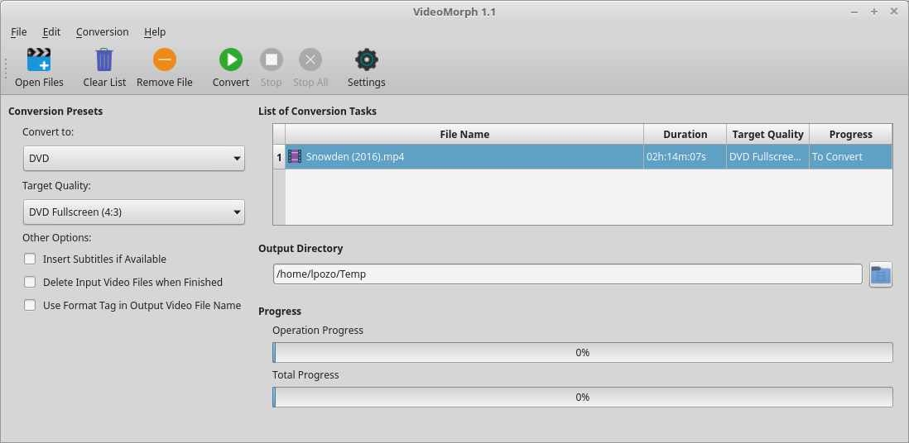

# VideoMorph

VideoMorph is a small GUI wrapper for [ffmpeg](http://ffmpeg.org)
based on code from [python-video-converter](https://github.com/senko/python-video-converter)
and presets idea from [QWinFF](http://qwinff.github.io).

##Screenshot

## Goal

Unlike other video converters, VideoMorph focuses on a single task,
convert video, making simple, easy to use and allowing the user choose outputting
between the most popular video formats.

VideoMorph UI is simple and clean focused on usability, eliminating annoying options rarely used.
Videomorph is a video converter, just that. If you want a video editor,
VideoMorph isn't for you.

## Installation and requirements

To install the package:

    python3 setup.py install

This only installs VideoMorph. The [ffmpeg](http://ffmpeg.org) package should be installed
or compiled in your distribution.

## Acknowledgements

VideoMorph uses the following libraries and programs:

 - [Qt5](http://www.qt.io/qt5-4/)
 - [PyQt5](https://riverbankcomputing.com/software/pyqt/download5)
 - [FFmpeg](ffmpeg.org)

You should have installed these programs and libraries for the proper
functioning of Videomorph.

## Contributing
Just clone the repo and make a pull request!

## Licensing and Patents

VideoMorph is licenced under Apache License Version 2.0, more info at [http://www.apache.org/licenses/](http://www.apache.org/licenses/)
Following the idea of [python-video-converter](https://github.com/senko/python-video-converter)
VideoMorph only uses the [ffmpeg](http://ffmpeg.org) binary, so, VideoMorph doesn't need to be licensed
under LGPL/GPL

## Authors and Copyright

Code & Artwork by:

 - [Ozkar L. Garcell](mailto:codeshard@openmailbox.org)
 - Leodanis Pozo Ramos (mailto:lpozo@openmailbox.org)

Contributors:

 - [Maikel LLamaret Heredia](http://swlx.cubava.cu)
 - [Carlos Parra Zaldivar](http://carlosp.cubava.cu)
