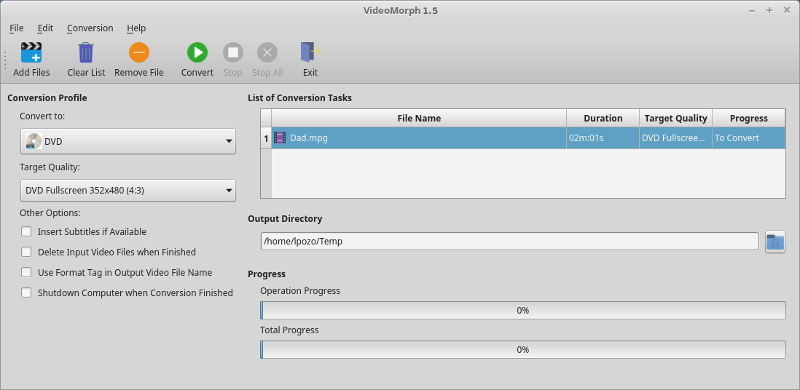
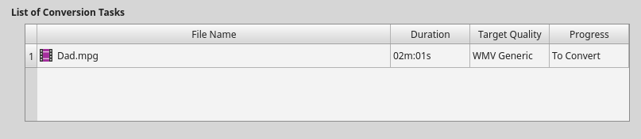
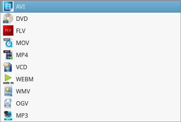
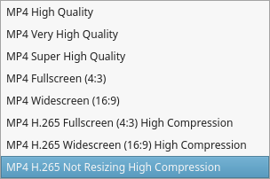
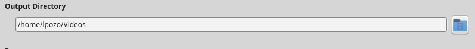
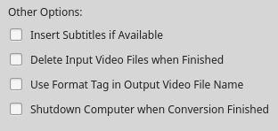
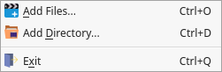
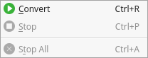
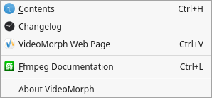

# **
VideoMorph
**

# **
User’s Manual
**

Version 1.5rc “Canelo”

---

[TOC]

## Introduction

**VideoMorph** is a multi-platform application, dedicated to the conversion of video formats. There are many applications for these purposes, but all of them have many options that can be complicated for new users, so we decided to focus on the main task, facilitating the conversion of your audiovisual materials in an intuitive and easy way. **VideoMorph** was developed with Python 3 programming language, Ffmpeg multimedia processing library and PyQt5 for the Graphical User Interface. With **VideoMorph** it is possible to convert your videos to the most popular video formats at present, such as **MP4, AVI,** **DVD, VCD,** **MOV,** **MPG, FLV, WEBM,** **OGV,** **WMV, MKV**, some of them ready to use in social networks like Youtube, also it is possible to use **VideoMorph** for extracting audio in **MP3** or **OGA** formats.

## ToolBar

It contains the elements:

- **Add Files**: Opens a dialog to select the video files you want to convert. Once selected, they are placed in the **List of Conversion Tasks**.

- **Clear List**: Deletes the entire List of Conversion Tasks.
- **Remove File**: Deletes an individual file selected from the files in the List of Conversion Tasks.
- **Convert**: Starts the Conversion Task processing all the files into the selected format.
- **Stop**: Stops converting the current Task.
- **Stop All**: Stops converting all the Tasks in the List of Conversion Tasks.
- **Exit**: Terminates VideoMorph.

## Main Window’s Options

- **Convert to**: Select the output video format, that is, the format you want to give to the files arranged in the List of Conversion Tasks, from the list of available video formats in the Convert to drop-down list

- **Target Quality**: Select the quality you want to use in the conversion process from the Target Quality drop-down list

- **Output Directory**: Selected output folder where the converted video files will be saved

- **Other Options**: Several options that may be useful

- **Insert Subtitles if Available**: This option is very interesting, because it allows us to embed the subtitle inside the video you are converting, as long as you have the subtitle file in ***.srt*** format.
- **Delete Input Video Files when Finished**: This allows you to delete the original video file when the conversion is finished, this way you will not have two identical video files, saving disk space.
- **Use Format Tag in Output Video File Name**: This allows us to include, in the name of the converted file, a format identification tag. It is useful when you want to do several conversions to several formats of the same video file.
- **Shutdown Computer when Conversion Finished**: It allows to shutdown the computer once the conversion process finished. It is useful when the List of Conversion Tasks is large and you don’t want to wait for the conclusion of the process to shutdown the computer.

## Main Menu

The Main Menu of the application has 4 entries: **File**, **Edit**, **Convert** and **Help**

- **File Menu**: Allows you to perform the following actions

1. Add files to the Conversion Task List.
2. Add a folder to convert all the video files contained in it.
3. Exit the Application.

- **Edit Menu**: Includes the following actions

1. Delete all video files from the List of Conversion Tasks.
2. Delete the selected video file from the List of Conversion Tasks.

- **Conversion Menu**: Allows you to perform the following actions

1. Starts the conversion process.
2. Stops the conversion of the current task.
3. Stops all processing of the videos included in the List of Conversion Tasks.

- **Help Menu**: Includes options

1. Shows the contents of this manual.
2. View the application Changelog.
3. Open VideoMorph Web Page.
4. Open the Online Documentation page for Ffmpeg library.
5. Display the About dialog.
