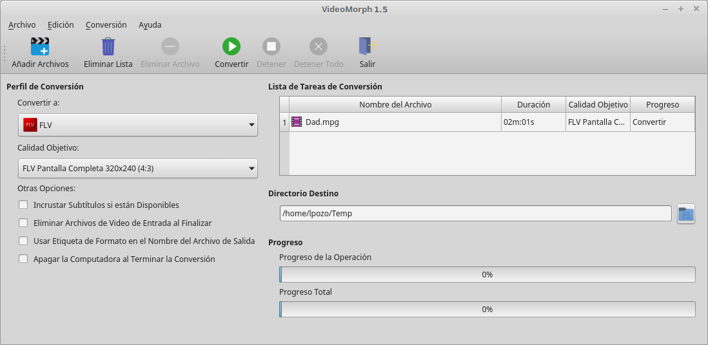
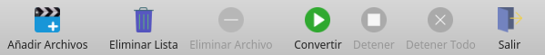
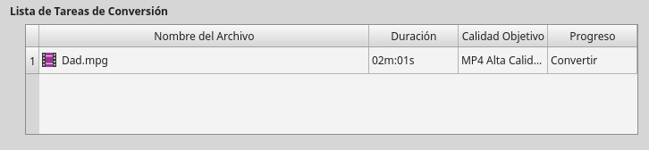
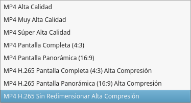
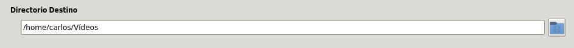
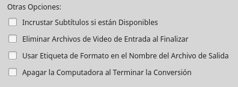
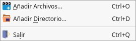
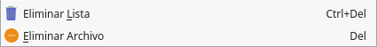
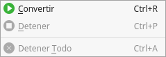
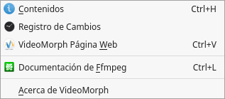

# **
VideoMorph
**

# **
Manual de Usuario
**

Version 1.5 “Canelo”

---

[TOC]

## Introducción

**VideoMorph** es una aplicación multiplataforma, dedicada a la conversión de formatos de video. Existen muchas aplicaciones para estos fines, pero todas de un modo u otro disponen de muchas opciones que pueden resultar complicadas para los usuarios noveles, por eso decidimos concentrar la atención en la tarea principal, facilitar la conversión de sus materiales audiovisuales de una manera intuitiva y fácil. **VideoMorph** se desarrolla con el lenguaje de programación Python 3, la librería de procesamiento multimedia Ffmpeg y PyQt5 para la Interfaz Gráfica de Usuario. Con **VideoMorph** es posible convertir a los formatos de video más empleados en la actualidad, dígase **MP4**, **AVI**, **DVD**, **VCD**, **MOV**, **MPG**, **FLV**, **WEBM**, **OGV**, **WMV**, **MKV**, algunos de ellos listos para usar en redes sociales como **Youtube**, también es posible usar **VideoMorph** para extraer el audio en formatos **MP3** y **OGA**.

## Barra de Herramientas

Contiene los elementos:

- **Añadir Archivos**: Abre un diálogo para seleccionar los archivos de video que desea convertir, una vez seleccionados, se ubican en la **Lista de Tareas de Conversión**.

- **Eliminar Lista**: Elimina toda la Lista de Tareas Conversión.
- **Eliminar Archivo**: Elimina el archivo seleccionado en la Lista de Tareas de Conversión.
- **Convertir**: Inicia la conversión de la Lista de Tareas de Conversión procesando todos los archivos en el formato seleccionado.
- **Detener**: Detiene la tarea de conversión actual.
- **Detener Todo**: Detiene todas las tareas de la Lista de Tareas de Conversión.
- **Salir**: Termina VideoMorph.

## Opciones de la Ventana Principal

- **Convertir a**: Selecciona el formato de video de salida, es decir, el formato que quiere darle a los archivos dispuestos en la lista de conversión, desde la lista desplegable de formatos de video disponibles

- **Calidad Objetivo**: Selecciona la calidad que desea emplear en el proceso de conversión, desde la lista desplegable de calidades objetivo

- **Directorio Destino**: Directorio seleccionado donde los archivos de video convertidos se guardarán

- **Otras Opciones**: Opciones que pudieran resultar útiles:

- **Incrustar Subtítulos si están Disponibles**: Esta opción es muy interesante, pues nos permite incrustar el subtítulo dentro del video a convertir, siempre y cuando disponga del archivo de subtítulos en formato ***.srt***.
- **Eliminar Archivos de Video de Entrada al Finalizar**: Esto permite eliminar el video original al concluir la conversión, de esta forma no tendrá dos archivos de video iguales, ahorrando espacio en disco.
- **Usar Etiqueta de Formato en el Nombre del Archivo de Salida**: Esto permite incluir en el nombre del archivo convertido una etiqueta identificativa del formato al que ha sido convertido. Es útil cuando se quiere hacer varias conversiones a distintos formatos de un mismo video.
- **Apagar la Computadora al Terminar la Conversión**: Permite apagar la computadora una vez concluido el proceso de conversión. Es útil cuando la Lista de Tareas de Conversión es grande y no se quiere esperar por la terminación del proceso para apagar la computadora.

## Menú Principal

El Menú Principal de la aplicación está compuesto por 4 elementos: Archivo, Edición, Conversión y Ayuda

- **Menú Archivo**: Permite realizar las acciones siguientes

1. Añadir archivos a la Lista de Tareas de Conversión.
2. Agrega una carpeta para convertir todos los archivos de video contenidos en ella.
3. Salir de la Aplicación.

- **Menú Edición**: Incluye las acciones siguientes

1. Eliminar todos los archivos de video de la Lista de Tareas de Conversión.
2. Eliminar el archivo de video seleccionado de la Lista de Tareas de Conversión.

- **Menú Conversión**: Permite realizar las acciones siguientes

1. Inicia el proceso de conversión.
2. Detiene la conversión del archivo de video en proceso.
3. Detiene todo el procesamiento de los videos incluidos en la Lista de Tareas de Conversión.

- **Menú Ayuda**: Incluye las opciones siguientes

1. Muestra el contenido de este manual.
2. Visualiza el registro de cambios de la aplicación.
3. Abre la página Web de VideoMorph.
4. Abre la página de Documentación en línea de la librería Ffmpeg.
5. Muestra el diálogo Acerca de.
